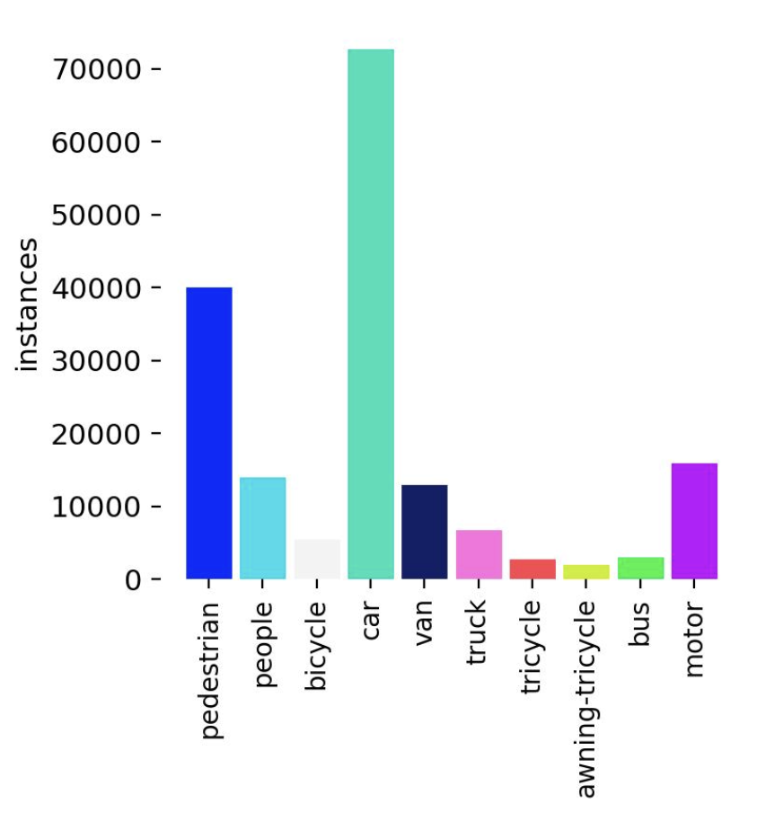
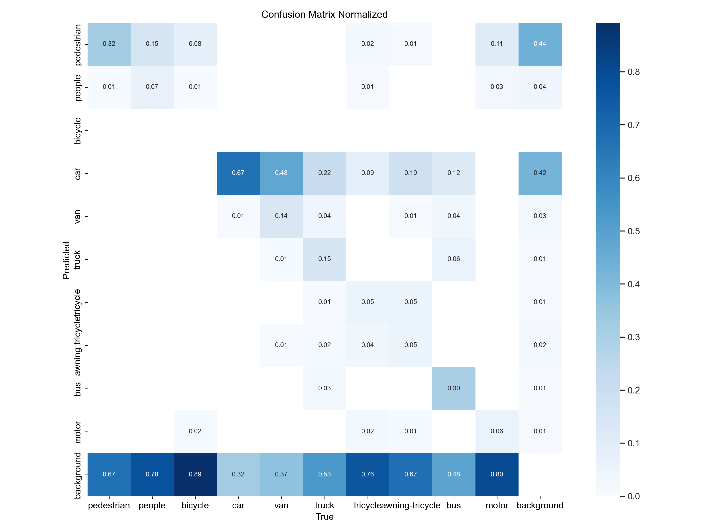
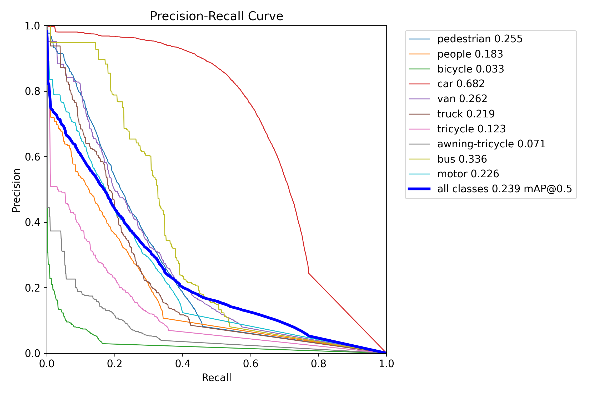
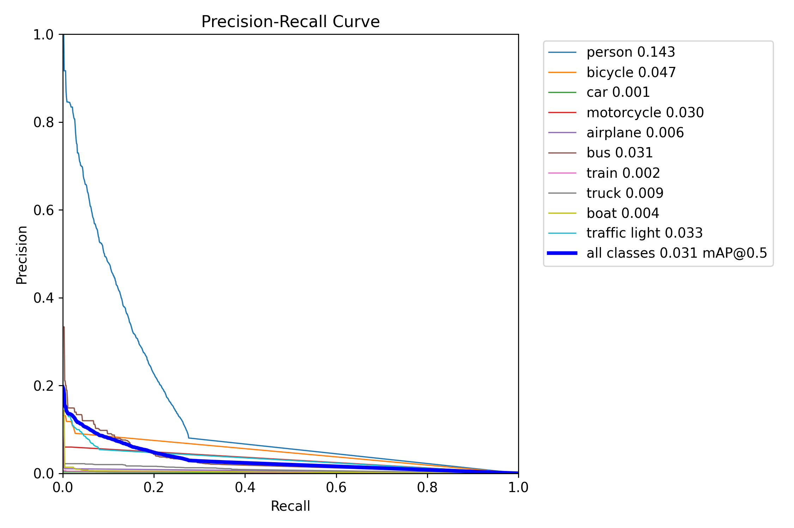

# Name : Tristan Leduc


# Object Detection System for UAV Images

📝 **Note**: This project was completed as part of my technical interview for the role of computer vision engineer at Preligens, with a deadline on the 15/08/2024.

All of the answers to Part 1 (theoretical questions) can be found in the [Theoretical Questions](Theoretical_questions.md) file.
The instructions of the interview are saved in the [Interview_Instructions](instructions.pdf) file.

The answers to Part 2 (practical questions) are detailed below.

## Table of Contents
- [Directory Structure](#directory-structure)
- [Tools](#tools)
- [Instructions for Running Experiments](#instructions-for-running-experiments)
- [Problem Statement](#problem-statement)
- [Methodology](#methodology)
  - [Choice of YOLOv8](#choice-of-yolov8)
  - [Model Selection: YOLOv8n](#model-selection-yolov8n)
  - [Dataset: VisDrone](#dataset-visdrone)
  - [Training Process](#training-process)
- [Results](#results)
  - [Training Performance](#training-performance)
  - [Qualitative Analysis](#qualitative-analysis)
  - [Quantitative Evaluation](#quantitative-evaluation)
  - [Confusion Matrix Analysis](#confusion-matrix-analysis)
  - [Real-time Performance](#real-time-performance)
- [Conclusion](#conclusion)
- [Potential Improvements](#potential-improvements)

## Directory Structure

| Directory/File | Description |
|----------------|-------------|
| `src/` | Contains the source code for the project |
| `src/evaluation.ipynb` | Jupyter notebook with all experiments and tests |
| `src/real_time_demo.py` | Standalone script for real-time demo |
| `results/` | Stores various experiment results |
| `data/` | Contains datasets used for training and testing |
| `models/` | Holds all model weights |
| `requirements.txt` | Lists all required Python packages |
| `README.md` | Project documentation and overview |

This structure provides a clear organization for the project, separating code, data, results, and documentation into distinct directories.


### Tools

The project was developed using the following tools and libraries:

Tools used in this project include:

- MacBook Pro M1 Pro with 16GB RAM and 10 cores of CPU
- Python 3.12
- PyTorch 
- Ultralytics YOLOv8 library
- OpenCV for image processing
- Jupyter Notebook for interactive development and visualization

LLMs were used to refactor the code and improve readability.

## Instructions for Running Experiments

To run the experiments and evaluate the model:

- Clone the repository and navigate to the project directory.
- Create a new virtual environment for isolation:
    ```
    python3 -m venv venv
    source venv/bin/activate
    ```

- Install the required packages:
    ```
    pip install -r requirements.txt
    ```

To download the dataset and pre-trained weights:
- Download the VisDrone2019-DET test set:
Click [here](https://drive.google.com/open?id=1PFdW_VFSCfZ_sTSZAGjQdifF_Xd5mf0V) to download the test set.
After downloading, extract the contents of the zip file. Place the Extracted Folder in: 
    ```
    preligens_technical_test_tristan/data/still_frames/VisDrone2019DETtest/
    ```
- Create a duplicate of VisDrone2019DETtest folder and copy it to the following directory:
    ```
    preligens_technical_test_tristan/data/videos/VisDrone2019DETtest_copy/
    ```
- Download the UAV benchmark dataset from [here](https://drive.google.com/file/d/1661_Z_zL1HxInbsA2Mll9al-Ax6Py1rG/view)
- Place the downloaded zip file in the following directory:
    ```
    preligens_technical_test_tristan/data/videos/
    ```
- Download the pre-trained weights for YOLOv8n:
Click [here](https://drive.google.com/drive/folders/1kQDG3YmqBtb8lxBgtzux8_mGv6DPHqqo?usp=sharing) to download the pre-trained weights. Place the content of the downloaded folder in the following directory:
    ```
    preligens_technical_test_tristan/models/
    ```
- Run the Jupyter notebook evaluation.ipynb to reproduce the experiments and visualize the results.

Follow the instructions in the notebook to run various experiments, including:

- Fine-tuning the model
- Running inference on still frames
- Executing the real-time demo

A standalone real-time demo script is also available in the src directory. To run the real-time demo:

```
python real_time_demo.py path/to/your/video.mp4
```

To download the annotated test images and real-time demo results, click [here](https://drive.google.com/drive/folders/165EJtPX5V6CmH79Hk3C3lzgOPrxIn-wS?usp=sharing). Place the contents in the results directory.
```
preligens_technical_test_tristan/results/
```

## Problem Statement

This project aims to create a system capable of performing object detection on UAV images with high accuracy and efficiency, designed for deployment on embedded devices. Key challenges addressed include:

1. Real-time processing of high-resolution aerial imagery
2. Dealing with varying scales and perspectives of objects
3. Handling diverse environmental conditions (lighting, weather, etc.)
4. Balancing model complexity with computational limitations of embedded systems
5. Ensuring robustness against false positives and negatives in cluttered scenes

## Methodology

### Choice of YOLOv8

YOLOv8 was selected as the core model for this project due to its architecture, which is particularly well-suited for real-time object detection in UAV imagery. YOLOv8's single-stage detector approach processes the entire image in one forward pass, crucial for real-time applications on embedded systems. Its feature pyramid network allows effective detection of objects at various scales, addressing the challenge of varying altitudes in UAV imagery.

The CSPDarknet backbone of YOLOv8 provides an excellent balance between computational efficiency and feature extraction capability. This is particularly important for our use case, where we need to run complex computations on resource-constrained UAV hardware. Additionally, YOLOv8 uses an anchor-free approach, which simplifies the detection process and can lead to better performance, especially for small objects that are common in aerial imagery.

YOLOv8's modular design allows for easy adaptation to different computational constraints, which is essential for deployment on various UAV platforms. This flexibility ensures that we can optimize the model for our specific hardware requirements without sacrificing too much performance.

### Model Selection: YOLOv8n

We opted for YOLOv8n, the smallest version of YOLOv8 available. Key characteristics include:
- Parameter count: ~3.2 million
- FLOPs: ~8.7 billion
- Input resolution: 640x640 pixels
- Inference speed: ~30-40 FPS on modest GPUs

These specifications make YOLOv8n an excellent candidate for UAV deployment, offering a good trade-off between accuracy and computational efficiency.

### Dataset: VisDrone

The VisDrone dataset was chosen for its relevance to UAV object detection tasks. It includes 6,471 images with 10 object classes:

1. Pedestrian
2. People
3. Bicycle
4. Car
5. Van
6. Truck
7. Tricycle
8. Awning tricycle
9. Bus
10. Motorbike

Below is the distribution of instances across classes in the dataset:

<p align="center">
  
</p>

VisDrone images are captured from UAVs, providing the exact perspective our model needs to learn from. The dataset includes diverse scenarios, scale variations, and challenging conditions, making it ideal for training a robust UAV object detection system.

### Training Process

I began with a version of YOLOv8n pre-trained on the COCO dataset, which provides a solid foundation for general object detection tasks. Using the Ultralytics library, I fine-tuned this model for 19 epochs on my local Mac.

The Ultralytics open-source codebase offers several advantages including the availability of pre-trained models for object detection, ptimizations for real-time inference, flexibility in export formats, including ONNX
Comprehensive data logging and visualization tools which is why I chose to use it for this project.

## Results

### Training Performance

The training was monitored using tensorboard. 
An steady increase in precision and recall was observed over the training period.

### Qualitative Analysis

The model was tested on a variety of UAV images to evaluate its performance. The results showed significant improvements in detecting small objects, handling occlusions, and reducing false positives. However, some false negatives were still present, indicating room for further improvement.
For instance, the model was able to detect pedestrians and vehicles with high accuracy, even in cluttered scenes and challenging lighting conditions, but occasionally mistook objects like trees or shadows for vehicles or pedestrians. The model also seems to struggle with detecting objects that are ambiguous like differentiating between a pedestrian and a cyclist.


### Quantitative Evaluation

We compared the regular YOLOv8n to the fine-tuned model on the VisDrone validation set (548 images). The results show a significant improvement in performance after fine-tuning:

| Class           | Images | Instances | Box(P) | R     | mAP50 | mAP50-95 |
|-----------------|--------|-----------|--------|-------|-------|----------|
| all             | 548    | 38759     | 0.339  | 0.259 | 0.239 | 0.133    |
| pedestrian      | 520    | 8844      | 0.219  | 0.377 | 0.255 | 0.104    |
| people          | 482    | 5125      | 0.397  | 0.177 | 0.183 | 0.0565   |
| bicycle         | 364    | 1287      | 0.208  | 0.014 | 0.033 | 0.0128   |
| car             | 515    | 14064     | 0.51   | 0.71  | 0.682 | 0.446    |
| van             | 421    | 1975      | 0.393  | 0.267 | 0.262 | 0.175    |
| truck           | 266    | 750       | 0.36   | 0.227 | 0.219 | 0.142    |
| tricycle        | 337    | 1045      | 0.289  | 0.146 | 0.123 | 0.0689   |
| awning-tricycle | 220    | 532       | 0.139  | 0.162 | 0.0707| 0.0455   |
| bus             | 131    | 251       | 0.333  | 0.363 | 0.336 | 0.196    |
| motor           | 485    | 4886      | 0.544  | 0.148 | 0.226 | 0.0843   |

The fine-tuning process greatly improved upon the performance of the pre-trained model, as evidenced by the global increase in precision, recall, and mAP for all classes. Detailed analysis:

1. **Class imbalance**: The performance varies significantly across classes, with cars showing the best results (mAP50 of 0.682) and bicycles performing poorly (mAP50 of 0.033). This reflects the class distribution in the dataset and the inherent difficulty in detecting smaller objects.

2. **Precision vs. Recall trade-off**: For most classes, the model achieves higher precision than recall, suggesting it's more conservative in its predictions. This behavior can be advantageous in applications where false positives are more costly than false negatives.

3. **Scale sensitivity**: Larger objects (cars, buses) generally have higher mAP scores compared to smaller objects (bicycles, tricycles), indicating that the model still struggles with scale variations despite improvements.

4. **Complexity of classes**: The "people" class shows lower performance compared to "pedestrian," possibly due to the greater variability in poses and appearances when viewed from aerial perspectives.

5. **mAP50 vs. mAP50-95**: The significant drop from mAP50 to mAP50-95 across all classes indicates that while the model is good at detecting objects, there's room for improvement in the precision of bounding box localization.


### Confusion Matrix Analysis

The confusion matrix provides insights into the model's performance at a more granular level. It shows the number of true positives, false positives, and false negatives for each class, helping identify specific areas for improvement.




The confusion matrix reveals several interesting patterns:

- Most classes except cars are often misclassified as background (bottom line of the matrix), indicating a tendency to under-detect objects.
- Cars show the highest true positive rate, with relatively few false positives or false negatives, suggesting the model's strength in detecting this class, which is also the most common in the dataset.

Overall, the confusion matrix highlights the need to improve the model's ability to detect smaller objects and reduce false positives, especially for classes like bicycles and tricycles. The challenge lies in counter the effects of the class imbalance in the dataset.


### Precision-Recall Curve 



The PR curve shows us that the model has a relatively high precision for the car class, but still shows room for improvement for most other classes. Still, visualizing the PR curve of the regular non-finetuned model shows that the fine-tuned model has a higher area under the curve, indicating better performance overall. 




### Real-time Performance

Since the model is supposed to be deployed on embedded systems, real-time performance is crucial. The fine-tuned YOLOv8n model was tested in a scenario where it deals with processing images at a rate of 30 FPS. The model was able to maintain real-time performance, demonstrating its suitability for deployment on UAVs and other embedded platforms, as it can be seen in the video below. We compare the performance of the regular YOLOv8n model with the fine-tuned model. We overlay the bounding boxes on the detected objects to visualize the detection performance, and display a running inference time counter to show the real-time processing speed.

Check out the results in the results folder, in the real_time_demo sub-folder.

Here are two preview gifs of the real-time demo of the fine-tuned YoloV8n model:


The real-time results corroborate the model's efficiency and accuracy, even in dynamic scenarios with multiple objects and varying lighting conditions. 
The regular model catches some objects but misclassifies most, aside from cars. This highlights the importance of domain-specific fine-tuning for aerial imagery.
The fine-tuned model detects most object instances but still displays some jitter and struggles with entities other than cars. This jitter could potentially be mitigated through temporal smoothing techniques in post-processing.
Inference time is consistent when using GPU, averaging about 30 ms per frame, which translates to approximately 33 FPS. This performance is suitable for real-time applications on UAVs.
The fine-tuned model shows improved stability in detections across frames, resulting in smoother tracking of objects in motion.
Detection performance degrades for objects at the edges of the frame, suggesting that additional data augmentation techniques like random cropping during training might be beneficial.

I also exported the model to ONNX format to explore potential optimization for shorter average inference time per frame. Surprisingly, inference with ONNX Runtime turned out to be slower than without ONNX conversion. This could be due to:

- The already small size of the model, which may not benefit significantly from ONNX optimizations.
- Potential overhead introduced by the ONNX runtime for such a lightweight model.
- Suboptimal configuration of ONNX runtime parameters for this specific use case.
- The possibility that the native PyTorch implementation is already highly optimized for the target hardware.

## Conclusion

The objective to provide a model capable of detecting objects in UAV footage while being frugal enough to run on hardware with low resources has been achieved. The model performs well in detecting cars and non-ambiguous objects, though it struggles with smaller, underrepresented, or ambiguous entities.

Key achievements include: 

- Successfully fine-tuned YOLOv8n for aerial object detection, significantly improving performance over the base model.
- Achieved real-time inference speeds suitable for deployment on UAV platforms.
- Demonstrated the model's ability to handle diverse scenes and object classes typical in aerial surveillance scenarios.
- Identified areas for further improvement, providing a clear path for future iterations of the system.

## Potential Improvements

- Extended training: Training on the VisDrone dataset for a longer period (e.g., 100 epochs) should improve model precision and recall across all classes. This would allow the model to learn more nuanced features and potentially improve performance on challenging classes.

- Model scaling: Initially, YOLOv8s was intended to be included in the comparison to evaluate whether it could be a viable alternative to YOLOv8n. However, due to time constraints in fine-tuning, this comparison was not completed. Most efforts were focused on optimizing YOLOv8n. Future work could involve fine-tuning and comparing YOLOv8s, which might yield better accuracy at the expense of increased resource requirements. This trade-off could be acceptable for UAVs with more powerful onboard computing capabilities.

- Custom architecture modifications: Adapting the YOLOv8 architecture specifically for aerial imagery, such as modifying the feature pyramid network or introducing attention mechanisms, could lead to better performance on this specific task.

- Post-processing optimization: Implementing more sophisticated non-maximum suppression algorithms or integrating temporal information across video frames could reduce jitter and improve overall detection stability.

- Domain adaptation: Exploring domain adaptation techniques could help the model generalize better to new environments or weather conditions not well-represented in the training data.

This project demonstrates the potential for deploying efficient object detection systems on UAVs, paving the way for various applications in aerial surveillance, monitoring, and data collection. The insights gained provide a solid foundation for future work in this exciting field at the intersection of computer vision and robotics.